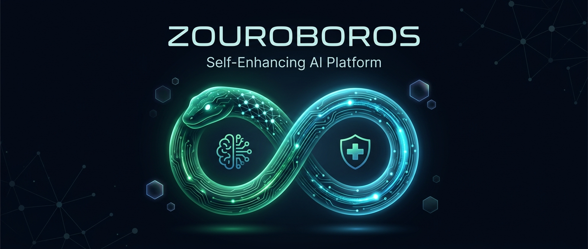
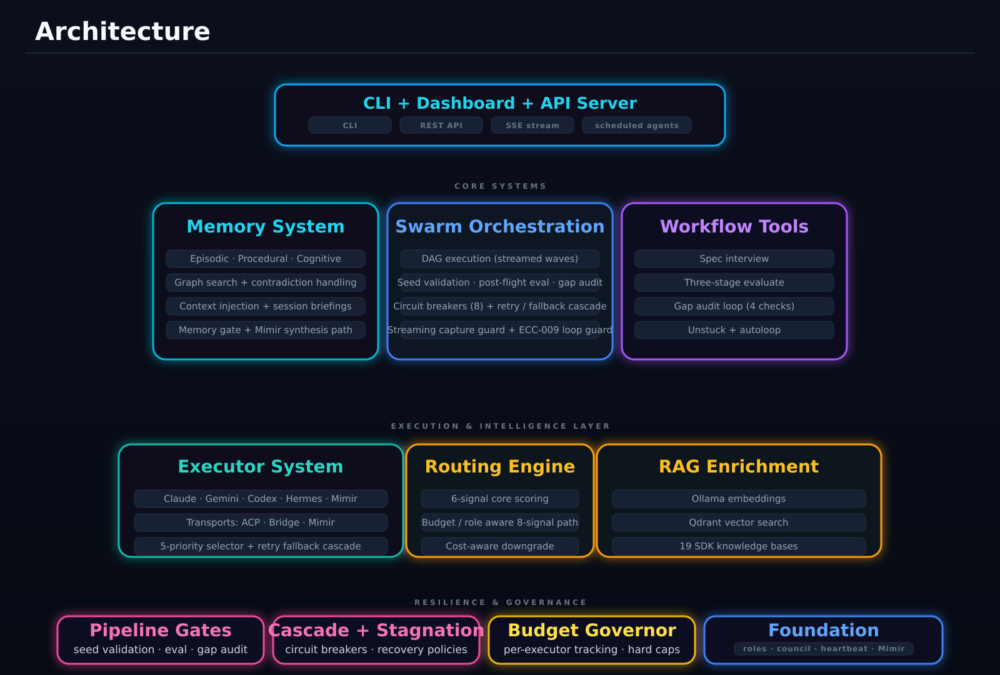

<p align="center">
  
</p>

<p align="center">
  <a href="https://github.com/marlandoj/zouroboros/actions/workflows/ci.yml"></a>
  <a href="https://github.com/marlandoj/zouroboros/releases"></a>
  <a href="https://www.npmjs.com/search?q=zouroboros"></a>
  <a href="https://opensource.org/licenses/MIT"></a>
  <a href="https://zo.computer"></a>
</p>

## Overview

Zouroboros is a self-enhancing AI platform built natively on [Zo Computer](https://zo.computer). It provides production-grade multi-agent orchestration, persistent memory, and autonomous self-healing — all in a unified monorepo. Every module is native to the Zo ecosystem, not ported from external platforms.

### Key Features

- **Hybrid Memory System** — SQLite + vector embeddings with episodic, procedural, and cognitive memory. Domain context injection bridges operational knowledge into swarm tasks.
- **Swarm Orchestration (v5)** — Multi-agent DAG execution with 4 executors (Claude Code, Gemini, Codex, Hermes), 8-signal composite routing, executor retry/fallback cascades, and mandatory pipeline gates.
- **Transport Abstraction** — Bridge and ACP (Agent Client Protocol) transports with real-time streaming, enabling communication with any executor backend.
- **Resilience-First** — Category-aware circuit breakers (8 failure types), cascade failure propagation with 4 recovery policies, stagnation detection with auto-recovery, and 5-layer loop guards (ECC-009).
- **Pipeline Gates** — Mandatory seed validation, post-flight evaluation, and gap audit loops enforce quality at every stage of swarm execution.
- **RAG Enrichment** — Ollama embeddings + Qdrant vector search across 19 indexed SDK knowledge bases, injected into task prompts automatically.
- **Budget Governance** — Per-executor token tracking with USD conversion, alert thresholds, hard caps, and automatic cost-aware executor downgrade.
- **Role Registry** — 57 seeded roles mapped from personas to executors, with hierarchical delegation and write scope isolation for child tasks.
- **Persona Framework** — SOUL/IDENTITY architecture with 8-phase creation workflow and persona-scoped fact storage.
- **Spec-First Development** — Interview, three-stage evaluate, gap audit (4 checks), unstuck, and autoloop tools.
- **Self-Healing** — Daily introspection, prescription, and autonomous evolution with 12 playbooks and a governor safety gate.
- **API Server** — Hono REST API with SSE event streaming for real-time budget, heartbeat, and task events.
- **Heartbeat Scheduler** — Persistent wake cycles with SQLite state for long-running swarm campaigns.

## Architecture

<p align="center">
  
</p>

The architecture is organized into 5 layers:

| Layer | Components |
|-------|-----------|
| **Interface** | orchestrate-v5 CLI, Hono REST API, SSE Event Stream, NL Command Center |
| **Core Systems** | Memory System, Swarm Orchestration, Workflow Tools |
| **Execution & Intelligence** | Executor System (4 executors, Bridge/ACP transport), 8-Signal Routing Engine, RAG Enrichment (Qdrant + 19 SDKs) |
| **Resilience & Governance** | Cascade Manager, Stagnation Detector, Budget Governor, Context Sharing |
| **Foundation** | Personas & Role Registry (57 roles), Self-Heal Engine (12 playbooks), Heartbeat Scheduler |

## Quick Start

### Install from npm

```bash
# Core types and utilities
npm install zouroboros-core

# Memory system (SQLite + vector embeddings)
npm install zouroboros-memory

# Multi-agent swarm orchestration
npm install zouroboros-swarm

# Spec-first workflow tools
npm install zouroboros-workflow

# Self-healing pipeline
npm install zouroboros-selfheal

# Persona framework
npm install zouroboros-personas

# RAG enrichment toolkit
npm install zouroboros-rag

# CLI (global install)
npm install -g zouroboros-cli
```

Or install everything:

```bash
npm install zouroboros-core zouroboros-memory zouroboros-swarm zouroboros-workflow zouroboros-selfheal zouroboros-personas zouroboros-rag
```

### From Source

```bash
git clone https://github.com/marlandoj/zouroboros.git
cd zouroboros
pnpm install
pnpm run build
zouroboros init
zouroboros doctor
```

### Skill Install (Zo Computer)

For distributing to other Zo Computers as standalone Bun scripts:

```bash
bun ~/Skills/zouroboros/scripts/install.ts
bun ~/Skills/zouroboros/scripts/doctor.ts
```

## Packages

| Package | Version | Description |
|---------|---------|-------------|
| [`zouroboros-core`](https://www.npmjs.com/package/zouroboros-core) |  | Types, config, utilities |
| [`zouroboros-memory`](https://www.npmjs.com/package/zouroboros-memory) |  | Hybrid SQLite + vector memory with domain context injection |
| [`zouroboros-swarm`](https://www.npmjs.com/package/zouroboros-swarm) |  | v5 orchestration: DAG execution, 8-signal routing, circuit breakers, pipeline gates, executor retry/fallback |
| [`zouroboros-workflow`](https://www.npmjs.com/package/zouroboros-workflow) |  | Interview, three-stage eval, gap audit, unstuck, autoloop |
| [`zouroboros-selfheal`](https://www.npmjs.com/package/zouroboros-selfheal) |  | Introspection, prescription & evolution with 12 playbooks |
| [`zouroboros-personas`](https://www.npmjs.com/package/zouroboros-personas) |  | SOUL/IDENTITY persona framework with scoped fact storage |
| [`zouroboros-rag`](https://www.npmjs.com/package/zouroboros-rag) |  | RAG enrichment: Ollama + Qdrant, 19 SDK knowledge bases |
| [`zouroboros-cli`](https://www.npmjs.com/package/zouroboros-cli) |  | Unified CLI |
| [`zouroboros-tui`](https://www.npmjs.com/package/zouroboros-tui) |  | Terminal dashboard |

## Swarm Orchestration

The swarm orchestrator runs multi-agent campaigns with mandatory quality gates:

```
Seed Spec → Seed Eval Gate → Execute DAG → Post-Flight Eval → Gap Audit Loop
```

### Executor System

4 executors communicate through a transport abstraction layer:

| Executor | Transport | Best For |
|----------|-----------|----------|
| Claude Code | Bridge / ACP | Complex implementation, architecture |
| Gemini | Bridge / ACP | Research, analysis, content |
| Codex | Bridge / ACP | Code generation, refactoring |
| Hermes | Bridge | Autonomous investigation, web research |

Executors are selected via a **5-priority routing decision tree**:
1. Explicit executor ID in task
2. Role-based resolution (57 seeded roles)
3. Budget override (< 20% remaining → cheapest executor)
4. 8-signal composite routing (capability, health, complexity, history, procedure, temporal, budget, role)
5. Tag-based heuristic fallback

When an executor fails, the **retry/fallback cascade** automatically reroutes to the next healthy executor with circuit breaker protection (10-min cooldown on credit exhaustion).

### Pipeline Gates

All three gates are enabled by default:

- **Seed Validation** — Pre-execution audit for file paths, schema correctness, DAG conflicts
- **Post-Flight Evaluation** — Success rate analysis with 50% threshold
- **Gap Audit Loop** — 4-question validation: reachability, data prerequisites, cross-boundary state, eval-production parity

### Resilience

- **Circuit Breakers** — 8 error categories with distinct thresholds and cooldowns (rate_limited: 1 failure/60s, timeout: 2 failures/30s, permission_denied: 1 failure/300s)
- **Cascade Manager** — 4 policies: abort_dependents, skip_dependents, retry_then_skip, isolate
- **Stagnation Detector** — Monitors no_output, repetitive_output, progress_plateau, timeout_approaching
- **ECC-009 Loop Guard** — 5-layer recursion prevention (origin headers, depth limits, cycle detection, chain timeout, circuit breaker)

## Usage

### CLI

```bash
# Memory
zouroboros memory store --entity user --key preference --value "dark mode"
zouroboros memory search "technology preferences"

# Swarm campaigns
zouroboros swarm run --tasks campaign.json

# Workflow
zouroboros workflow interview --topic "Design a database schema"
zouroboros workflow evaluate --seed seed.yaml --artifact ./src
zouroboros workflow unstuck --signal "same error keeps happening"

# Persona creation
zouroboros persona create --name "Security Auditor" --domain security

# Self-healing
zouroboros heal introspect
zouroboros heal prescribe
zouroboros heal evolve

# Dashboard
zouroboros tui
```

### Programmatic (TypeScript)

```typescript
import { Memory } from 'zouroboros-memory';
import { SwarmOrchestrator } from 'zouroboros-swarm';

const memory = new Memory({ dbPath: './memory.db' });

await memory.store({
  entity: 'user',
  key: 'preference',
  value: 'TypeScript',
  category: 'preference',
  decayClass: 'permanent',
});

const results = await memory.search({ query: 'programming languages' });

const orchestrator = new SwarmOrchestrator();
await orchestrator.run({
  tasks: [
    { id: '1', persona: 'Backend Developer', task: 'Design API' },
    { id: '2', persona: 'Frontend Developer', task: 'Build UI', dependsOn: ['1'] },
  ],
});
```

### Natural Language (Zo Chat)

```
Store in memory that I prefer TypeScript for backend development
Run a spec-first interview for building a REST API
Check my Zouroboros system health
```

## Scheduled Agents

After installation, create scheduled agents from Zo Chat:

```
Create all Zouroboros agents from agents/manifest.json
```

This registers 5 agents on your Zo Computer:
- **Memory Embedding Backfill** — indexes new facts nightly
- **Memory Capture** — captures conversation facts
- **Unified Decay** — runs memory decay and cleanup
- **Self-Enhancement Summary** — daily introspect → prescribe → evolve
- **Vault Indexer** — indexes workspace files into the knowledge graph

## Configuration

```yaml
# ~/.zouroboros/config.yaml
defaults:
  memory:
    dbPath: ~/.zo/memory/shared-facts.db
    embeddingModel: nomic-embed-text
  swarm:
    localConcurrency: 8
    timeoutSeconds: 600
    routingStrategy: balanced  # fast | reliable | balanced | explore
    pipelineGates:
      seedValidation: true
      postFlightEval: true
      gapAudit: true
```

## Development

```bash
git clone https://github.com/marlandoj/zouroboros.git
cd zouroboros
pnpm install
pnpm run build
pnpm test  # 757+ tests
```

## Documentation

- **[Installation Guide](./docs/getting-started/installation.md)** — Get started in minutes
- **[Quick Start](./docs/getting-started/quickstart.md)** — Build your first project
- **[Architecture Overview](./docs/architecture/overview.md)** — System design
- **[CLI Reference](./docs/reference/cli-commands.md)** — Complete command reference

## Contributing

Contributions are welcome! Please read our [Contributing Guide](./CONTRIBUTING.md) for details.

## License

MIT License — see [LICENSE](./LICENSE) for details.

## Acknowledgments

- Inspired by [Q00/ouroboros](https://github.com/Q00/ouroboros) for spec-first development patterns
- Inspired by Karpathy's AutoResearch and 2ndBrain concepts for auto-loop and memory enhancements
- Built natively on [Zo Computer](https://zo.computer) — [try Zo Computer](https://zo-computer.cello.so/IgX9SnGpKnR)
- Thanks to all contributors and the Zo community

---

**Made with care for the Zo Computer ecosystem**
