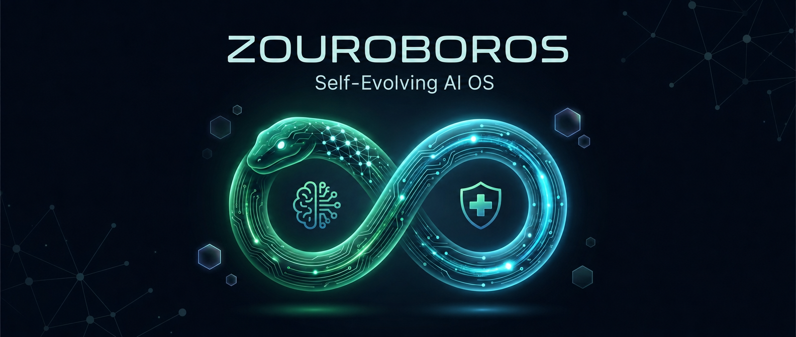

<p align="center">
  
</p>

<p align="center">
  <a href="https://github.com/marlandoj/zouroboros/actions/workflows/ci.yml"></a>
  <a href="https://github.com/marlandoj/zouroboros/releases"></a>
  <a href="https://www.npmjs.com/search?q=zouroboros"></a>
  <a href="https://opensource.org/licenses/MIT"></a>
  <a href="https://zo.computer"></a>
</p>

## Overview

Zouroboros is a self-evolving AI operating system built natively on [Zo Computer](https://zo.computer). It is a governed control layer for persistent memory, multi-agent orchestration, and procedure evolution — in one monorepo.

- **Memory** — hybrid SQLite + vector store (episodic, procedural, and cognitive) with domain context injection.
- **Swarm** — multi-agent DAG execution across 8 executors with adaptive routing and mandatory quality gates.
- **Self-healing** — a daily introspect → prescribe → evolve loop, guarded by a multi-vendor consensus gate.
- **Local deterministic replay** — secret-redacted HTTP and ACP tool cassettes feed ZouroBench, Snakepit, and skill crystallization; automated promotion requires a replay pass.
- **Workflow & personas** — spec-first interview / evaluate / gap-audit tools and a SOUL/IDENTITY persona framework.

## Install

Zouroboros has **two layers**, so there are **two installation paths**:

- **Compute layer** — the npm packages (CLI + libraries). **Portable**: runs on any Bun/Node system.
- **Experience layer** — skills, hooks, MCP servers, scheduled agents, conditional rules. **Zo-Computer-native** (hooks live in `~/.claude/settings.json`, skills in `~/Skills/`, agents/rules via the platform API — no standalone equivalent).

Pick the path that matches your platform.

### Path A — Zo Computer (full experience)

You get the compute layer **plus** the self-evolving experience layer that only a Zo Computer provides:

- **Everything in Path B** (CLI, memory, swarm, consensus gate + MoA, workflow, self-heal, personas)
- **Skills surface** (`~/Skills/`) and the `~/.zo/memory` persona store
- **`UserPromptSubmit` / `PostToolUse` hooks** wired into `~/.claude/settings.json`
- **`.mcp.json` graph + RAG MCP servers**
- **Scheduled agents** — the daily memory-capture → decay → introspect → prescribe → evolve loop
- **Conditional rules**

Clone the repo, run `bun install && bun run build`, then follow the [installation guide](./docs/getting-started/installation.md). Scheduled agents and rules are created from Zo Chat (there is no HTTP API for them).

### Path B — Non-Zo Computer (compute layer)

On any Bun/Node box you get the full compute layer as a CLI and libraries — no Zo Computer required:

```bash
npm install -g zouroboros-cli
zouroboros init      # scaffold config, memory database, and bundled skills
zouroboros doctor    # verify your environment
```

Or embed the libraries directly:

```bash
npm install zouroboros-core zouroboros-memory
```

**What you get:** the unified `zouroboros` CLI, hybrid SQLite + vector memory, multi-agent swarm orchestration, the multi-vendor consensus gate + MoA (Mixture-of-Agents) panel, spec-first workflow tools, self-heal, and personas — all usable as CLIs or imported libraries. See [Packages](#packages).

**What you don't get** (Zo-only, see Path A): the Skills surface, `UserPromptSubmit`/`PostToolUse` hooks, `.mcp.json` graph + RAG MCP servers, the `~/.zo/memory` persona store, scheduled agents (the governed self-evolution loop), and conditional rules.

> **Requires [Bun](https://bun.sh) 1.x** (both paths) — the memory layer imports `bun:sqlite`. Set `OPENAI_API_KEY` to enable semantic vector search; without it, memory degrades gracefully to full-text search. Set `OPENROUTER_API_KEY` to activate the 3-model consensus / MoA panel. Multi-agent campaigns additionally need at least one general-purpose executor binary (`claude`, `codex`, `gemini`, `hermes`, `opencode`, `kimi`, or `pi`) — `zouroboros doctor` reports what's available.

## Packages

| Package | Version | What it provides |
|---------|---------|------------------|
| [`zouroboros-cli`](https://www.npmjs.com/package/zouroboros-cli) |  | Unified CLI — `init`, `doctor`, memory, swarm, workflow, heal |
| [`zouroboros-core`](https://www.npmjs.com/package/zouroboros-core) |  | Types, config, and shared utilities |
| [`zouroboros-memory`](https://www.npmjs.com/package/zouroboros-memory) |  | Hybrid SQLite + vector memory and the memory-gate daemon |
| [`zouroboros-swarm`](https://www.npmjs.com/package/zouroboros-swarm) |  | Multi-agent orchestration: DAG execution, adaptive routing, pipeline gates |
| [`zouroboros-workflow`](https://www.npmjs.com/package/zouroboros-workflow) |  | Spec-first interview, evaluate, gap audit, unstuck, autoloop |
| [`zouroboros-selfheal`](https://www.npmjs.com/package/zouroboros-selfheal) |  | Introspection, prescription, and autonomous evolution |
| [`zouroboros-personas`](https://www.npmjs.com/package/zouroboros-personas) |  | SOUL/IDENTITY persona framework with scoped fact storage |
| [`zouroboros-rag`](https://www.npmjs.com/package/zouroboros-rag) |  | RAG enrichment: OpenAI embeddings + Qdrant retrieval |

The CLI + core + memory are the validated MVP. The remaining packages extend the platform and install the same way.

## Usage

```bash
# Memory
zouroboros memory store --entity user --key preference --value "dark mode"
zouroboros memory search "technology preferences"

# Multi-agent campaign
zouroboros swarm run --tasks campaign.json

# Spec-first workflow
zouroboros workflow interview --topic "Design a database schema"

# Self-healing loop
zouroboros heal introspect && zouroboros heal prescribe && zouroboros heal evolve
```

Or use it programmatically:

```typescript
import { Memory } from 'zouroboros-memory';

const memory = new Memory({ dbPath: './memory.db' });
await memory.store({ entity: 'user', key: 'preference', value: 'TypeScript', category: 'preference' });
const results = await memory.search({ query: 'programming languages' });
```

## How it works

Swarm campaigns run through mandatory quality gates end to end:

```
Seed Spec → Seed Eval Gate → Execute DAG → Post-Flight Eval → Gap Audit Loop
```

Eight executors (Claude Code, Hermes, Gemini, Codex, OpenCode, Kimi, Pi, and Mimir) are chosen by an adaptive router, protected by circuit breakers and retry/fallback cascades. Procedure changes are validated by a multi-vendor **consensus gate** before they land. See the [architecture overview](./docs/architecture/overview.md) and [executor capability matrix](./packages/swarm/docs/executors/capability-matrix.md) for the full picture.

## Documentation

- **[Installation](./docs/getting-started/installation.md)** and **[Quick Start](./docs/getting-started/quickstart.md)**
- **[Architecture Overview](./docs/architecture/overview.md)** — layers, executors, routing, resilience
- **[Health Council](./docs/architecture/health-council.md)** — the self-monitoring watchers
- **[CLI Reference](./docs/reference/cli-commands.md)** — complete command list

## License

MIT — see [LICENSE](./LICENSE). Built natively on [Zo Computer](https://zo.computer); inspired by [Q00/ouroboros](https://github.com/Q00/ouroboros) and Karpathy's AutoResearch / 2ndBrain concepts.
