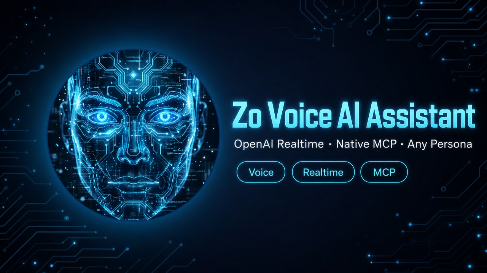
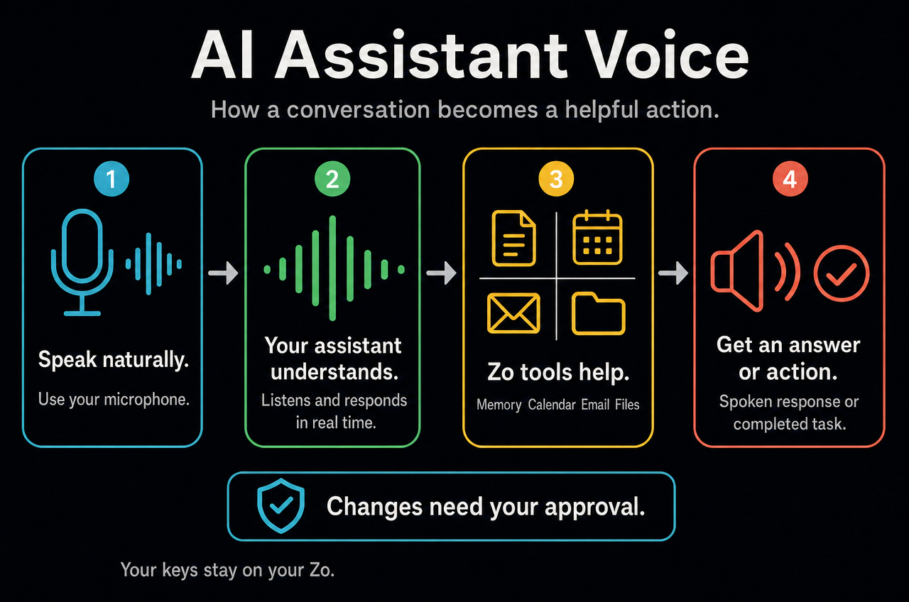

# Zo Voice AI Assistant



A voice interface for [Zo Computer](https://zo.computer) personas using **OpenAI Realtime API (GA, `gpt-realtime-2`)** with native MCP tool integration. Speak to any persona, hear it speak back, and let it call your Zo tools directly — all keys stay server-side.

Built as a Progressive Web App (PWA) deployed to your `zo.space`. Works with any of your Zo personas — pick from the dropdown at runtime.

---

## Architecture



At a glance:

1. **Speak naturally** using your microphone.
2. **Your assistant listens and responds** in real time.
3. **Zo tools help when needed** with memory, Gmail, Google Calendar, Linear projects, email, and files.
4. **You hear the answer or receive the completed task.** Changes require your approval.

The technical routes and tool packs are documented below for readers who need implementation details.

### Tool packs

| Pack | Tools | `require_approval` |
|------|-------|--------------------|
| `essentials` | 28 — memory, Gmail read, Calendar read, Linear projects + issue detail, factory status + run details, GitHub status, Drive search, service logs, Alaric read-only delegate, email/SMS send, file read, web search | per-tool: email/SMS writes `always`, reads `never` |
| `power` | 35 — adds image search/gen, transcription, calendar create | per-tool: writes `always`, reads `never` |
| `power_with_writes` | 43 — adds agent/automation/route writes, persona switch, publish | per-tool: writes `always`, reads `never` |

---

## Routes deployed by `deploy-tts-endpoint.ts --deploy-all`

The `<slug>` is derived from `--name` (e.g. `--name "Aria"` → `aria-*`). Defaults to `voice` if no name is given. The `<path>` is `--path` (default `/ai-assistant-voice`).

| Route | Type | Purpose |
|-------|------|---------|
| `/api/tts` | api | TTS proxy (ElevenLabs / OpenAI / edge-tts backends) |
| `/api/<slug>-ask` | api | Text-mode Zo Ask proxy (fallback for non-Realtime mode) |
| `/api/<slug>-bootstrap` | api | HMAC session token issuer (24h TTL) |
| `/api/realtime-session` | api | OpenAI Realtime session mint + MCP tool config |
| `/api/<slug>-mcp` | api | JSON-RPC 2.0 MCP server, 43 tools, 3-tier auth |
| `/api/<slug>-personas` | api | Dynamic persona catalog — `list_personas` MCP (HMAC + ETag) |
| `<path>` | page | The React PWA |
| `<path>/manifest` | api | PWA install manifest |
| `<path>/sw` | api | Service worker (offline shell) |

---

## Requirements

- A [Zo Computer](https://zo.computer) account
- [Bun](https://bun.sh) runtime (pre-installed on Zo)
- Zo Secrets (Settings → Advanced → Secrets):
  - `ZO_ASK_TOKEN` — HMAC secret + Zo Ask proxy auth
  - `ZO_API_KEY` — used by `/api/<slug>-mcp` + `/api/<slug>-personas` to call upstream Zo MCP
  - `MCP_SHARED_TOKEN` — shared secret for OpenAI Realtime → MCP (`openssl rand -hex 32`). The env-var **name** is configurable; pass `--mcp-token-secret YOUR_NAME` to the deploy script to rename it (e.g. `ARIA_MCP_TOKEN`).
  - `OPENAI_API_KEY` — for Realtime sessions + OpenAI TTS backend
  - `LINEAR_API_KEY` — read-only access to Linear project status and recent issue updates
  - `ELEVENLABS_API_KEY` — only if using ElevenLabs TTS backend (optional)
  - `MEMORY_DB_PATH` — *optional.* Absolute path to a SQLite memory backend exposing `facts`/`facts_fts`/`open_loops` tables for the `memory_search` + `list_open_loops` tools. Default `/home/workspace/.zo/memory/shared-facts.db`. If unset or the file doesn't exist, those tools degrade gracefully ("memory not configured") and the rest of the assistant works unchanged.

---

## Installation

### 1. Clone

```bash
git clone https://github.com/marlandoj/ai-assistant-voice.git \
  /home/workspace/Skills/ai-assistant-voice
```

Or, in natural language to your Zo: *"Install the ai-assistant-voice skill from GitHub and set it up."*

### 2. Set secrets

In Zo Computer → Settings → Advanced → Secrets:
- Create an access token, save it as `ZO_ASK_TOKEN`
- Save your `ZO_API_KEY`, `OPENAI_API_KEY`
- Generate the MCP shared secret: `openssl rand -hex 32`, save as `MCP_SHARED_TOKEN` (or any name you prefer — see step 3)

### 3. Deploy

```bash
bun /home/workspace/Skills/ai-assistant-voice/scripts/deploy-tts-endpoint.ts --deploy-all
```

Default backend is ElevenLabs. Use `--backend openai` or `--backend edge` to switch.

**Rename the MCP token secret** (optional). The shared-secret env var defaults to `MCP_SHARED_TOKEN`. To use a custom name, pass `--mcp-token-secret`:

```bash
bun /home/workspace/Skills/ai-assistant-voice/scripts/deploy-tts-endpoint.ts \
  --deploy-all \
  --name "Aria" \
  --mcp-token-secret "ARIA_MCP_TOKEN"
```

The flag value is upper-cased and sanitized to `[A-Z0-9_]`. Save your generated secret under whatever name you pass — both the MCP server route and the Realtime session route will read `process.env[<that name>]`.

### 4. Open the PWA

Visit `https://yourhandle.zo.space<path>` (default `/ai-assistant-voice`, private — sign in to view). Pick a persona from the dropdown (populated dynamically from your own Zo personas), tap the mic, talk.

### 5. Install to phone (optional)

Open in Chrome/Safari on mobile → "Add to Home Screen." Launches full-screen with offline shell.

---

## v3.2.0 — Latency & naturalness tunings

Five production improvements sourced from Bhargava/Together AI's *"Engineering voice agents"* talk, applied to `realtime-session-route.ts` and `pwa-page.tsx`:

| # | Feature | Effect |
|---|---------|--------|
| 1 | **Semantic VAD** | Distinguishes a thinking pause from end-of-turn — stops the model from cutting you off mid-thought |
| 2 | **Full-duplex barge-in** | Model stops the instant you start speaking — natural interruption, no half-second lag |
| 3 | **Thinker-talker back-channel** | Silent on fast tool calls; one brief acknowledgment ("One moment.") on slow ones — eliminates dead air without over-narrating |
| 4 | **Voice delivery suffix** | Pronunciation guidance + emotional register injected into every session — more consistent, expressive tone |
| 5 | **Latency observability** | `[latency] time-to-first-audio: Xms` + per-tool-call ms logged to console — pinpoint where delays come from |

No config changes needed — redeploy with `deploy-tts-endpoint.ts --deploy-all` to pick up all five.

---

## TTS backend comparison

| Backend | Voice quality | Cost | API key |
|---------|--------------|------|---------|
| ⭐ ElevenLabs | Best — natural, expressive | ~$0.30 / 1K chars | `ELEVENLABS_API_KEY` |
| OpenAI TTS | Very good — 6 voices | ~$0.015 / 1K chars | `OPENAI_API_KEY` |
| edge-tts | Good — 300+ neural voices | Free | none |
| Browser SpeechSynthesis | Basic | Free | none (fallback) |

In **Realtime mode** (default), OpenAI handles audio synthesis directly via WebRTC — the `/api/tts` proxy is only used in text-mode fallback or for the v1 vanilla shell at `pwa/`.

---

## Repository layout

```
Skills/ai-assistant-voice/
├── assets/
│   ├── alaric-bootstrap-route.ts     # HMAC token issuer (template)
│   ├── alaric-mcp-route.ts           # JSON-RPC MCP server, 43 tools (template)
│   ├── alaric-personas-route.ts      # Dynamic persona catalog via list_personas (template)
│   ├── ai-ask-route.ts               # Text-mode Zo Ask proxy
│   ├── realtime-session-route.ts     # OpenAI Realtime mint
│   ├── pwa-page.tsx                  # React PWA (placeholderized)
│   ├── manifest-route.ts             # PWA manifest
│   ├── sw-route.ts                   # Service worker
│   ├── tts-route.ts                  # ElevenLabs TTS
│   ├── tts-route-openai.ts           # OpenAI TTS
│   ├── tts-route-edge.ts             # edge-tts
│   └── zo-ask-route.ts               # Legacy (used by v1 vanilla pwa/)
├── scripts/
│   ├── deploy-tts-endpoint.ts        # Deploys all routes
│   ├── ai-assistant-voice.ts         # CLI: voice configs, TTS test
│   └── setup-edge-tts.sh             # One-time edge-tts install
├── pwa/                              # v1 vanilla JS shell (legacy)
└── docs/
    ├── alaric-voice-v3-architecture.png
    └── alaric-voice-v3-architecture.svg
```

---

## CLI

```bash
cd /home/workspace/Skills/ai-assistant-voice/scripts

bun ai-assistant-voice.ts voices                    # List ElevenLabs voices
bun ai-assistant-voice.ts config set \
  --persona <persona-id> --name "My Assistant" --voice ErXwobaYiN019PkySvjV
bun ai-assistant-voice.ts config list
bun ai-assistant-voice.ts speak "Hello, Sir." --voice ErXwobaYiN019PkySvjV
```

Configs at `~/.zo/voice/persona-voices.json`.

---

## Customizing the assistant image

Default avatar is a holographic AI face at `/images/ai-assistant-portrait.png`. To replace:

Ask Zo: *"Change the AI assistant avatar to [description]"* — it'll generate and upload.

Or manually: replace the asset at `/images/ai-assistant-portrait.png` on your zo.space.

The image is displayed as a 260×260 circle with an animated glow when speaking.

---

## Configuring assistant identity

The skill is brand-neutral. Every public-facing identity surface is configured at deploy time via flags.

```bash
bun /home/workspace/Skills/ai-assistant-voice/scripts/deploy-tts-endpoint.ts \
  --deploy-all \
  --host yourhandle.zo.space \
  --name "Nova" \
  --path "/nova" \
  --persona-id "<your-persona-uuid>" \
  --default-voice "shimmer"
```

| Flag | Default | Effect |
|------|---------|--------|
| `--name` | `My Assistant` | Display name in UI; sets `<slug>` for route paths (`/api/<slug>-*`) |
| `--path` | `/ai-assistant-voice` | URL path for the PWA page |
| `--persona-id` | *(none)* | Default persona — usually one of your own from [Settings → AI → Personas](/?t=settings&s=ai&d=personas) |
| `--default-voice` | `alloy` | Fallback OpenAI voice when the persona has none configured |
| `--host` | Auto-detected | Override Zo Space hostname |

Placeholders substituted at deploy time across every route + the PWA page:
`{{ASSISTANT_NAME}}`, `{{ASSISTANT_SLUG}}`, `{{ZO_HOST}}`, `{{PAGE_PATH}}`, `{{DEFAULT_PERSONA_ID}}`, `{{DEFAULT_VOICE}}`, `{{PORTRAIT_PATH}}`, `{{PERSONAS_JSON}}`.

The persona dropdown is populated **dynamically** — `/api/<slug>-personas` calls the upstream `list_personas` MCP tool on every request (5-min ETag cache), so each fork sees its own personas with zero hardcoded UUIDs.

---

## License

MIT
