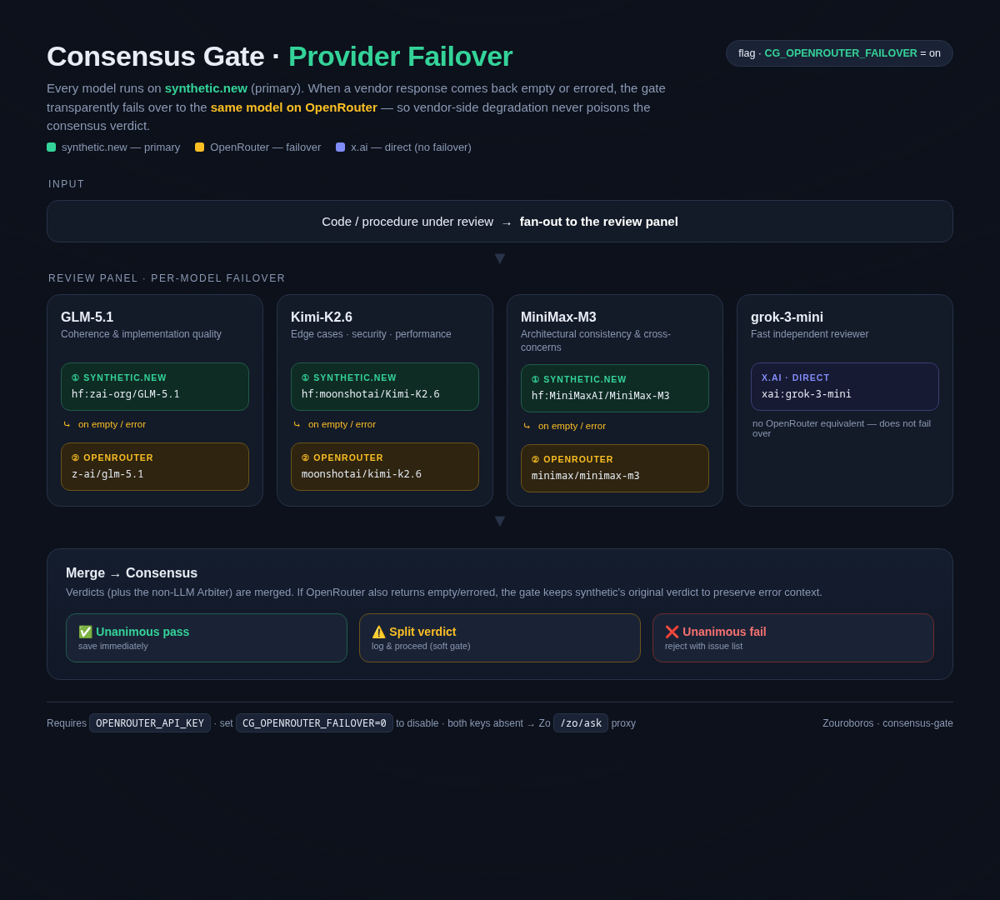

# Consensus Gate

**Multi-vendor code validation** — currently live in zouroboros procedure evolution. Before any evolved procedure step commits to `shared-facts.db`, three frontier models review it in parallel. Unanimous failure blocks the commit.

**v2.1 changes:** diff-scoped prompts, structured objection classification (PATCH_SPECIFIC / PRE_EXISTING / OUT_OF_SCOPE), VENDOR_ERROR bucket excluded from signal/noise math, and `noise-stats` for tracking signal-vs-noise over time. Backward-compatible — `verdicts[].issues` still emits formatted strings.

---

## Quick start

```bash
cd /home/workspace/Skills/consensus-gate

# Validate full file/snippet
bun scripts/consensus-gate.ts validate \
  --code "function addUser(name, email) { ... }" \
  --criteria "security,correctness,perf" \
  --label "new-user-step"

# Validate a diff (auto-detected from `diff --git` / `@@` markers)
bun scripts/consensus-gate.ts validate \
  --file /tmp/patch.diff \
  --label "PR #123: ledger fix"

# Force scope explicitly
bun scripts/consensus-gate.ts validate --file foo.ts --scope full --label "foo"
bun scripts/consensus-gate.ts validate --file bar.diff --scope diff --label "bar"

# Validate the exact active lineup without sending a code-review payload
bun scripts/consensus-gate.ts preflight --models "oc:model-a,or:vendor/model-b,hf:vendor/model-c"

# Noise/signal report (last 7 days)
bun scripts/consensus-gate.ts noise-stats --since 7

# Custom model trio
bun scripts/consensus-gate.ts validate \
  --models "hf:zai-org/GLM-5.1,hf:moonshotai/Kimi-K2.6,hf:deepseek-ai/DeepSeek-V3.2" \
  --code "..." --criteria "security"

# Retrieve a result
bun scripts/consensus-gate.ts result cg-1778362278914-x16fxm

# List recent validations
bun scripts/consensus-gate.ts list --limit 10
```

---

## How it works

1. **Input** — code (or diff) to validate + criteria (e.g., `correctness,security`)
2. **Scope selection** — `--scope auto|diff|full` (default `auto`). Auto-detects unified-diff hunk markers (`diff --git`, `@@ -.. +.. @@`) or the `=== DIFF ===` header used by `pre-merge-gate`. In `diff` mode the prompt instructs reviewers to ignore unchanged context and to mark any pre-existing concern as `PRE_EXISTING`.
3. **Mandatory readiness preflight** — before any submitted code is sent, every required reviewer and aggregator route must return a schema-valid consensus verdict. Provider errors, HTTP 429, timeouts, empty output, and malformed JSON are resolved through bounded fallback chains during this preflight. The first healthy route is bound to the review seat.
4. **Fail closed** — if any required seat has no transport- and schema-healthy route, the gate emits `ESCALATE`/`HOLD` with `codePayloadSent: false`; no code-review request is sent.
5. **Bound parallel fan-out** — only the preflight-approved routes receive the code. Runtime substitution is disabled for those calls, preventing a late fallback from changing the reviewed panel after payload submission.
6. **Collect verdicts** — each returns `{ pass, objections[], confidence }` (see schema below). Legacy `{ issues: [string] }` responses still parse.
7. **Per-verdict effective pass** — a verdict is `pass: false` ONLY if at least one objection is `PATCH_SPECIFIC` AND `severity: blocker`. Verdicts that returned `pass: false` but contained only `PRE_EXISTING` / `OUT_OF_SCOPE` objections are *overridden* to PASS and tagged `overridden: true`.
8. **Consensus rule** (computed from effective pass):
   - **All pass** → ✅ `passed`, proceed
   - **All fail** → ❌ `rejected`, reject with merged issue list
   - **Mix** → ⚠️ `split`, log, proceed (soft gate)
9. **Output** — JSON result to stdout, including the readiness attempts and bound serving routes. Each verdict carries both the structured `objections` array and the backward-compat `issues: string[]` (formatted as `"[scope/severity] text"`).

---

## Architecture & diagrams



*synthetic.new is **primary**; on an empty or errored verdict the gate fails over to the **same model on OpenRouter** (IDs auto-mapped, e.g. `hf:zai-org/GLM-5.1` → `z-ai/glm-5.1`). `grok-3-mini` routes to x.ai directly and does not fail over. Gated by `CG_OPENROUTER_FAILOVER` (default on).*

**Diagram locations:**

| Diagram | Location |
|---|---|
| Provider-failover infographic (PNG) | `assets/consensus-gate-failover.png` |
| Infographic source (editable HTML) | `assets/consensus-gate-failover.html` |
| Pipeline + failover ladder (ASCII) | [`INTEGRATION.md`](INTEGRATION.md) → *Architecture* and *Provider Failover (OpenRouter)* |

---

## Model lineup

| Role | Model | Source | Quirk |
|---|---|---|---|
| Coherence + impl quality | `hf:zai-org/GLM-5.1` | Zhipu/API | Outputs in `reasoning_content` |
| Edge cases + security | `hf:moonshotai/Kimi-K2.6` | Moonshot | Deep context, thorough |
| Architectural consistency | `xai:grok-3-mini` | x.ai | Prefers `XAI_API_KEY` for direct x.ai routing; falls back to chain via active LLM provider |

**Provider credentials:**
1. **`SYNTHETIC_NEW_API_KEY`** *(primary)* — full `hf:` model routing with fallback chains. Set in [Settings > Advanced](/?t=settings&s=advanced).
2. **`OPENROUTER_API_KEY`** *(failover)* — when synthetic.new returns an empty/errored verdict, the gate fails over to the **same model** on OpenRouter (`hf:` IDs are auto-mapped to OpenRouter slugs, e.g. `hf:zai-org/GLM-5.1` → `z-ai/glm-5.1`). Gated by `CG_OPENROUTER_FAILOVER` (default on; set `0` to disable). If `SYNTHETIC_NEW_API_KEY` is absent entirely, OpenRouter becomes the sole provider.
3. **`ZO_TOKEN`** *(soft degrade)* — proxies all three calls through `/zo/ask`; vendor diversity is lost (same model votes 3×).
4. **`KIMI_API_KEY`** *(direct Kimi)* — routes `kimi:` model IDs to `https://api.moonshot.ai/v1/chat/completions`. The direct catalog is restricted to Kimi K3, K2.7 Code, K2.7 Code HighSpeed, K2.6, and K2.5.
5. **None** — mock mode (CI only, not production-safe).

### Role, capability, and weight taxonomy

Selection uses three independent dimensions. A model's **role** says what job it performs, its **capability tier** says how much quality/cost headroom the role requires, and its **weight policy** says whether open, closed, or either kind of model may compete.

| Canonical role | Capability tier | Ranking evidence | Use |
|---|---|---|---|
| `deep-reasoning` | frontier | ZouroBench proposer | architecture, difficult reasoning, high-complexity synthesis |
| `coding` | strong | ZouroBench Code when qualified | implementation, refactoring, tests, code repair |
| `fast` | efficient | ZouroBench proposer | routine, latency-sensitive, low-cost work |
| `judge` | frontier | ZouroBench aggregator | structured review, objections, and adjudication |

Every role accepts `--weights any|open-only|closed-only`. This allows open- and closed-weight models to compete for the same job while preserving an operator's deployment constraint.

The original profile names remain compatibility presets:

| Compatibility preset | Canonical translation |
|---|---|
| `flagship` *(default)* | `deep-reasoning` + `any` |
| `open-weights` | `deep-reasoning` + `open-only` |
| `fast` | `fast` + `any` |
| `coder` | `coding` + `any` |
| `judge` | `judge` + `any` |

```bash
bun scripts/lineup-picker.ts --profile fast --json     # or LINEUP_PROFILE=fast (CLI wins)
GATE_LINEUP_PROFILE=fast bun scripts/consensus-gate.ts --code file.ts   # gate consumes the persisted profile lineup

# Canonical selection; these persist independently when the weight policy is non-default.
bun scripts/lineup-picker.ts --role coding --weights open-only --json
GATE_LINEUP_ROLE=coding GATE_LINEUP_WEIGHT_POLICY=open-only bun scripts/consensus-gate.ts preflight
```

- Canonical default selections reuse the compatible artifact paths. Non-default combinations persist to `~/.zouroboros/lineup.<role>.<open|closed>.json`; the deep-reasoning singleton `lineup.json` remains the renderer/API source.
- Gate precedence: `CONSENSUS_MODELS` (explicit) > `GATE_LINEUP_ROLE` + `GATE_LINEUP_WEIGHT_POLICY` > legacy `GATE_LINEUP_PROFILE` > default panel. An explicitly requested missing or invalid persisted selection fails closed; it never executes a different panel.
- Production picking and persisted-artifact validation require current healthy routes. Fresh schema-level `::review` probe health overrides stale transport/catalog health, so a failed seat cannot be immediately selected again during regeneration.
- Thin profiles report `valid: false` rather than borrowing from other tiers; escalation to a stronger panel is the escalation valve's job, not the picker's.
- **Calibration caveat:** cheaper panels can miss what a flagship panel catches. Watch per-tier recall via the reconciled holdout (P1-7) and the P2-6 $/resolved-task ledger before trusting `fast` as a default for anything gate-critical.
- "Budget" is intentionally not a profile — the sort already prefers $0-marginal subscription/flat-rate providers (PR #271).

#### ZouroBench role evidence

The picker consumes publishable ZouroBench v2 cohorts from `packages/bench/data/runs` and `packages/bench/data/staging` as a quality-ranking signal after tier, lifecycle, route-health, and family-diversity eligibility has passed.

- A cohort must be complete, fresh, deduplicated by run id, meet its declared replicate minimum with distinct indexes and seeds, and share the active dataset/question-set/adapter/judge/embedding/token context fingerprint.
- Comparable measured candidates rank ahead of candidates without evidence, then by the conservative 95% selection floor for the requested role. Existing provider, cost, family, and label ordering remains the deterministic tie-break path.
- Deep-reasoning and fast proposer evidence uses procedural recall, cross-persona transfer, and swarm context propagation. Judge and aggregator evidence uses cross-persona transfer and swarm context propagation.
- The current benchmark does not support the coder role. Coder lineups retain the established provider/cost ordering and explicitly report that evidence gap instead of borrowing an unrelated score.
- Benchmark evidence never promotes a model, heals a failed route, overrides a profile tier, or turns duplicate canonical families into independent votes. Missing evidence lowers ranking confidence but does not make an otherwise eligible model invalid.

Inspect the active evidence without mutating a lineup:

```bash
bun scripts/zourobench-lineup-evidence.ts --json
bun scripts/lineup-picker.ts --profile flagship --json --dry-run
```

Synchronize the current production seats and `SHADOW_PROMOTION_TARGETS` into the
versioned benchmark roster, then inspect or advance the bounded cohort queue:

```bash
bun scripts/zourobench-lineup-roster.ts --write --json
bun /home/workspace/packages/bench/scripts/lineup-model-bench.ts plan --json
bun /home/workspace/packages/bench/scripts/lineup-model-bench.ts run --max-replicates 1
```

The runner keeps one route-specific five-seed cohort per canonical model and
advances only one replicate by default. It refuses completed cohorts that still
fail evidence qualification. Coder-only entries stay visible in the roster with
`unsupported-role` status and are not run until ZouroBench has a governed coding
suite; memory/reasoning scores must never rank coder proposers.

#### Repairing an invalid persisted profile

Do not hand-edit `~/.zouroboros/lineup.<profile>.json`. A persisted profile becomes invalid when one or more stored routes disappeared from the current catalog, its canonical families collide, a member has not completed lifecycle promotion, or fresh schema-level review health is absent/failing.

1. Refresh provider catalogs with `bun scripts/catalog-refresh-all.ts`.
2. Probe prospective canonical routes with `bun scripts/consensus-gate.ts preflight --models "id-a,id-b,id-c,id-d"`; this sends no code payload and updates review health.
3. For non-promoted candidates, run the targeted cold-start and shadow-promotion lane. Production eligibility still requires 10 passing UTC days over at least 14 elapsed days.
4. Regenerate with `bun scripts/lineup-picker.ts --profile <profile> --json` only after the pool contains three healthy proposer families plus a fourth distinct aggregator family.
5. Confirm the persisted profile through `GATE_LINEUP_PROFILE=<profile> bun scripts/consensus-gate.ts preflight` before submitting code.

Provider diversity supplies routes; canonical model-family diversity supplies independent votes. Multiple providers can carry the same model family, but those routes are fallbacks for one seat, not additional quorum members.

### Dedicated consensus quality profile (shadow)

The dedicated `consensus` artifact is intentionally separate from the MoA lineups above. All four seats use the canonical `judge` role and frontier capability tier. It uses three blind reviewers plus one independent adjudicator, preserves dissent, and emits only a verdict with evidence. It never synthesizes or rewrites the reviewed artifact. `--weights any|open-only|closed-only` applies the deployment constraint independently from the Judge role.

```bash
# Create or replace the shadow profile. All four seats must be explicitly pinned.
bun scripts/consensus-profile.ts pick \
  --reviewers "byok:905b6491-3b7f-4ed6-864c-a9817603cb0f,hf:zai-org/GLM-5.2,or:deepseek/deepseek-r1-0528" \
  --adjudicator "xai:grok-3-mini" \
  --weights any \
  --json

bun scripts/consensus-profile.ts validate --json
bun scripts/consensus-quality-gate.ts probe
bun scripts/consensus-quality-gate.ts run \
  --file /tmp/change.diff \
  --criteria "correctness,security,behavioral-regression" \
  --label "shadow-review" \
  --json
```

- The lineup is stored separately at `~/.zouroboros/lineup.consensus.json`; it never mutates `lineup.json` or any cost-tiered MoA profile.
- `run` automatically performs the same role-specific probe as `probe` before reviewing the artifact. All three reviewers and the adjudicator must have a schema-valid primary or same-family fallback route before any artifact content is sent.
- The four model ids and canonical model families must be distinct. Providers are routing infrastructure, may repeat across seats, and do not affect quorum validity; provider reuse remains visible in gate evidence for operations. Unavailable seats, malformed verdicts, and evidence-backed critical objections fail closed to `HOLD`.
- Automatic PASS requires three valid reviewer PASS verdicts. A `2 PASS + 1 FAIL` split invokes the adjudicator, but split-pass authority remains disabled during calibration.
- Results append to `~/.zouroboros/consensus-profile-shadow.jsonl`; role-specific transport and schema health is written to `~/.zouroboros/consensus-profile-health.json`.
- `FACTORY_CONSENSUS_PROFILE_SHADOW=1` invokes the profile from the completed-execution factory consensus path. The shadow result is persisted as `profile_shadow` evidence but cannot change the authoritative factory decision.
- The topology is inspired by four-seat quorum discipline. It is not a Byzantine fault-tolerance guarantee because semantic LLM errors are probabilistic and correlated.

### Fast-to-Flagship profile valve (ZOU-579)

The profile valve is a shadow-first routing layer for advisory reviews. It runs the `fast` profile first, escalates on dissent, `status=escalate`, low confidence, malformed output, or panel failure, and fails toward `flagship`.

```bash
bun scripts/profile-escalation-valve.ts \
  --mode shadow \
  --review-mode judge \
  --code "candidate output" \
  --criteria "factual-accuracy,judge-calibration" \
  --label "advisory-review" \
  --json
```

- Shadow mode always runs both profiles and returns the Flagship decision. A clean Fast result is logged with `trigger=forced_shadow`, not treated as authoritative.
- Enforce mode is unavailable until `profile-escalation-promotion.ts` derives an eligible artifact from at least seven UTC observation days, the configured comparable-sample floor, and zero severe Flagship misses.
- The promotion artifact is bound to the exact shadow-ledger SHA-256 digest and the ordered Fast/Flagship panel fingerprints. New observations or lineup changes invalidate it until regeneration.
- Artifacts expire after 24 hours by default, and the latest comparable shadow observation must be equally fresh. Repeated artifact regeneration cannot replace continuing shadow canaries.
- Shadow ledgers are cohort-aware: observations from earlier lineup fingerprints remain auditable but do not count toward the current panel's sample/day floor.
- An absent, stale, malformed, or ineligible artifact downgrades an enforce request to shadow; it never silently authorizes Fast.
- The append-only ledger records profiles, trigger, decision source, latency, severe-miss status, consensus IDs, and cost-ledger join IDs. It stores an input hash, not submitted code.
- Authoritative runs use a separate `profile-escalation-enforce.jsonl` audit ledger, so they cannot invalidate the shadow ledger and promotion artifact that authorized them.
- Each gate child must prove `lineup_source=persisted-profile`, the requested profile, and a matching panel fingerprint. Inherited `CONSENSUS_MODELS` overrides are removed from valve children; missing lineups fail toward Flagship rather than falling back under a false profile label.
- If the valve process itself fails in ZouroBench, the adapter makes one direct, profile-proven Flagship attempt before retaining the primary advisory judgment.
- ZouroBench exposes the first advisory consumer through `--profile-valve-shadow`. Existing consensus and enforcement callers are unchanged unless they explicitly opt in.

---

## Integration: zouroboros (LIVE)

Wired at `zouroboros/packages/memory/src/standalone/memory.ts:1103` in `evolveProcedure()`:

```typescript
const stepCode = JSON.stringify(validSteps, null, 2);
const validationOutput = execSync(
  `bun "${consensusGatePath}" validate --code ${JSON.stringify(stepCode)} --criteria "correctness,consistency,security" --label "procedure-${procedureName}-v${current.version + 1}"`,
  { encoding: "utf-8", stdio: ["pipe","pipe","pipe"] }
);
const validationResult = JSON.parse(validationOutput);

if (validationResult.consensus.pass === false) {
  const issues = validationResult.verdicts
    .flatMap((v: any) => v.issues || [])
    .join("; ");
  throw new Error(`Consensus gate rejected: ${issues}`);
}
```

The gate is wrapped in `try/catch` — script failure (missing, crash, API timeout) logs a warning and proceeds. This ensures zouroboros never hard-blocks on a gate outage.

---

## Output schema

```typescript
{
  id: string;                    // cg-{timestamp}-{random}
  timestamp: string;             // ISO 8601
  label: string;                 // "procedure-x-v3"
  code: string;                  // original input
  criteria: string;              // "correctness,security"
  verdicts: [{
    model: string;               // "hf:zai-org/GLM-5.1"
    pass: boolean;               // EFFECTIVE pass (post noise-suppression)
    modelPass: boolean;          // raw verdict from model
    overridden: boolean;         // true if effective != modelPass
    issues: string[];            // ["[PATCH_SPECIFIC/blocker] missing null-check"]
    objections: [{
      text: string;
      scope: "PATCH_SPECIFIC" | "PRE_EXISTING" | "OUT_OF_SCOPE"
           | "UNCLASSIFIED" | "VENDOR_ERROR";
      severity: "blocker" | "warning" | "info";
    }],
    confidence: number;          // 0.0–1.0 (vendor errors = 0)
    latencyMs: number;           // 4500
    api: "synthetic.new" | "zo-proxy";
  }],
  consensus: {
    unanimous: boolean;
    pass: boolean | null;        // true / false / null (split)
    confidence: number;
  },
  metrics: {
    scope: "diff" | "full";
    detected_diff: boolean;
    total_objections: number;    // includes vendor_errors
    classified_objections: number; // total - vendor_errors; denominator for ratios
    patch_specific: number;
    pre_existing: number;
    out_of_scope: number;
    unclassified: number;        // legacy responses (no scope field)
    vendor_errors: number;       // HTTP/timeout/parse failures — infra, not quality
    blockers_patch_specific: number;
    signal_ratio: number;        // patch_specific / classified_objections
    noise_ratio: number;         // (pre_existing + out_of_scope) / classified_objections
    overrides: number;           // verdicts where effective != modelPass
    would_have_failed: boolean;  // would consensus have rejected without override?
  },
  status: "passed" | "rejected" | "split"
}
```

### Reviewer prompt schema (model output)

```json
{
  "pass": true,
  "objections": [
    {
      "text": "missing null-check on user.email before lookup",
      "scope": "PATCH_SPECIFIC",
      "severity": "blocker"
    }
  ],
  "confidence": 0.85
}
```

`scope` is REQUIRED on every objection. `pass: false` is reserved for blocking PATCH_SPECIFIC objections; PRE_EXISTING and OUT_OF_SCOPE concerns are surfaced but do not block.

**VENDOR_ERROR** is reserved for the gate itself — emitted when a model call returns HTTP error, times out, or returns unparseable JSON. It is excluded from `signal_ratio` and `noise_ratio` denominators so a provider outage cannot trip the noise alarm. Models should never emit `VENDOR_ERROR` themselves; any model-emitted occurrence is silently downgraded to `UNCLASSIFIED`.

---

## Logging

**Database:** `~/.zouroboros/consensus-gate.json` (JSON array, all results — includes structured `metrics`)

**Log:** `~/.zouroboros/consensus-gate.log` (JSON Lines, append-only — includes per-run `metrics.signal_ratio`, `noise_ratio`, `overrides`, `would_have_failed`)

Query from bash:
```bash
grep '"status":"rejected"' ~/.zouroboros/consensus-gate.log | tail -5
```

## Monitoring noise vs signal

```bash
bun scripts/consensus-gate.ts noise-stats --since 7
```

Reports:
- `signal_ratio` (PATCH_SPECIFIC / classified objections) and `noise_ratio` ((PRE_EXISTING + OUT_OF_SCOPE) / classified objections) over the window. Classified = total minus VENDOR_ERROR, so a provider outage cannot move the needle.
- `vendor_error_rate` — fraction of verdicts that failed for infrastructure reasons (HTTP, timeout, parse). Watch separately; this is a vendor-health signal, not a gate-quality signal.
- `override_rate` — fraction of verdicts where the noise-suppression rule flipped a model's `pass: false` to PASS
- `would_have_failed_rate` — fraction of runs that would have been REJECTED if we trusted raw model `pass` instead of the effective rule
- Top-5 noisiest and top-5 highest-signal labels (n≥3 classified objections)
- Trend: noise ratio in the recent half of the window vs the prior half

## Candidate shadow promotion

Approved catalog candidates advance through targeted cold-start and daily advisory
evidence. The target list is required so catalog discovery cannot create an
unbounded daily API workload.

```bash
export SHADOW_PROMOTION_TARGETS="oc:model-a,or:vendor/model-a,hf:vendor/model-b"
bun scripts/cold-start-probe.ts probe --models "$SHADOW_PROMOTION_TARGETS" --json
bun scripts/quarantine.ts shadow
```

The shadow cycle replays one unseen unanimous production case per target, records
the advisory vote in reputation, and counts no more than one promotion observation
per UTC day. Candidate status changes to `promoted` after 10 passing days over at
least 14 elapsed days; adding the candidate to `DEFAULT_QUORUM` or `DEFAULT_MOA`
remains an operator action.

If noise climbs (e.g. noise_ratio > 45% sustained, or `would_have_failed_rate` > 20%) the gate is generating more friction than value — that's the signal to wire deferred item #3 (scope precheck + 2-round cap for refactors).

### Automated noise watch

```bash
bun scripts/noise-watch.ts --since 7
```

Computes `HEALTHY` / `WARN` / `CRITICAL` / `DATA_GAP` from the noise-stats payload and emits a one-line verdict. Default thresholds: WARN at noise≥45% or would-fail≥20%, CRITICAL at noise≥65% or would-fail≥40%. Exit codes: `0` healthy, `1` data gap, `2` warn, `3` critical — usable as the `command` of a scheduled agent that pages on regression.

To wire as a weekly Zo agent (suggested, not auto-created):
```
schedule: weekly Mon 09:00 America/Phoenix
command: source /root/.zo_secrets && bun /home/workspace/Skills/consensus-gate/scripts/noise-watch.ts --since 7
delivery: email if exit ≥ 2
```

---

## Cost

| Path | Cost |
|---|---|
| Synthetic.new direct (default) | $0 (credited key) |
| Zo `/zo/ask` fallback | Consumes Zo credits |

Direct path is preferred: lower latency, no credit burn.

---

## Failure modes

| Scenario | Behavior |
|---|---|
| API 429 / 500 | Individual model FAILs with "HTTP 429", consensus computed from remaining |
| `SYNTHETIC_NEW_API_KEY` missing | Falls back to Zo `/zo/ask` proxy (if `ZO_TOKEN` available) |
| Missing script (`ENOENT`) | Warn + skip, no block |
| Model returns empty | Verdict `pass: false`, `issues: ["Empty response"]` |
| Model returns malformed JSON | Verdict `pass: false`, `issues: ["JSON parse failed: ..."]` |
| All 3 models fail | Consensus = `rejected` (unanimous failure to validate) |

---

## Related

- `INTEGRATION.md` — zouroboros wiring details
- `agent-doctor` — diagnose scheduled agents
- Three-stage-eval — pre-execute swarm validation
