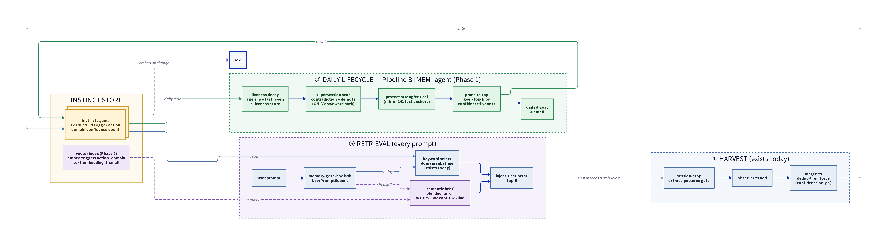

# Instinct Lifecycle & Semantic Search — Design Sketch

**Status:** DRAFT for review — nothing wired, nothing committed
**Date:** 2026-07-10
**Author:** Alaric (for marlandoj)

---

## 1. Why we're here

The daily `[MEM] Decay Memory` agent (Memory Pipeline B) prunes and synthesizes the
episodic/semantic memory store. The open question was whether instinct knowledge
should ride along. Tracing the read path answered a prior question first: **instincts
are not unwired.** They fire on every prompt via `memory-gate-hook.sh`, which calls
`observer.ts brief` and injects an `<instincts>` block. The `[Session Briefing —
Instincts]` you see at the top of prompts *is* the system working.

So this is not "turn instincts on." It's "give the corpus that already exists a
maintenance lifecycle and better retrieval." Two gaps, two phases.

### The two gaps

| Gap | Today | Consequence |
|-----|-------|-------------|
| **No lifecycle** | `prune.ts` is manual-only; cap 200 never hit (123 live); confidence is **monotonic** (`Math.max` on reinforce — only ratchets up, never down) | Stale or contradicted instincts persist at full strength. Confidence is a high-water mark, not a live reliability signal. |
| **Crude retrieval** | `selectForBriefing` floats instincts whose `domain` substring literally appears in the prompt, then slices top-N by confidence | Keyword-only. A prompt about "the conveyor" won't surface a `factory`-domain instinct unless the word "factory" appears. No semantics. |

---

## 2. The shape of the answer

You were partial to prune/decay; you also saw value in semantic search; and you
asked whether it has to be a tradeoff. **It doesn't.** They operate on different
axes and compound rather than compete:

- **Lifecycle** decides *what deserves to exist and at what strength* (write/maintain side).
- **Semantic index** decides *what surfaces for a given prompt* (read side).

A healthy lifecycle makes semantic results trustworthy (you're searching a pruned,
liveness-weighted corpus, not a junk drawer). Semantic retrieval makes a well-maintained
corpus actually reachable. Do lifecycle **first** — it's the foundation, and it validates
your own instinct to start with prune/decay.



*Grey = exists today · Green = Phase 1 (lifecycle) · Purple = Phase 2 (semantic).*

---

## 3. Phase 1 — Confidence Lifecycle (foundation)

Runs inside Pipeline B, once daily, right alongside memory decay. Advisory-first
(report before it mutates), same discipline as every prior factory phase.

### 3.1 Liveness decay
A **liveness score** separate from confidence, derived from `last_seen` age. Recent,
repeatedly-reinforced instincts stay live; ones untouched for a long window fade.

- Confidence stays a **quality** signal; liveness is a **recency** signal. We never
  conflate them.
- Decay is gentle and continuous, not a cliff.

### 3.2 Supersession demotion — the *only* downward confidence path
Today nothing can lower confidence. That's wrong for a rule that's been *contradicted*
(not just gone quiet). We mirror the memory system's supersedes-aware machinery (P1-4):
when a newer instinct contradicts an older one on the same trigger, the older one is
**demoted**, and the newer one carries a pointer to what it replaced.

- Two kinds of "change over time," handled separately:
  - **Staleness** (instinct went quiet) → liveness decay.
  - **Contradiction** (instinct is now wrong) → supersession demotion.
- This is the piece that makes "instincts change over time" safe.

### 3.3 Protection
Strong, high-confidence, or explicitly-critical instincts are **protected** from
eviction — the same pattern as fact-decay's 141 protected articulation points. Your
"stronger instincts always surface" requirement is a first-class rule, not a side effect.

### 3.4 Prune
After liveness + supersession + protection, prune to cap by a blended keep-score
(confidence · liveness), protecting anchors. Turns the manual `prune.ts` into a
scheduled, principled step.

### 3.5 Daily digest
A short report (what decayed, what was demoted/superseded, what was pruned, what's
protected) emailed with the Pipeline B run so you see the corpus breathing.

---

## 4. Phase 2 — Semantic Index (retrieval upgrade)

Only after Phase 1 is trusted.

### 4.1 Embed the corpus
Embed each instinct's `trigger + action + domain` with `text-embedding-3-small`
(same model already used in the memory runtime) into a searchable vector index,
kept in sync on write/lifecycle changes.

### 4.2 Blended-rank brief
`observer.ts brief` gains a semantic path: rank by

```
score = w1·similarity + w2·confidence + w3·liveness
```

so retrieval blends *relevance to this prompt*, *quality*, and *recency*. The keyword
path stays as a cheap fallback (and A/B baseline). The `<instincts>` injection contract
is unchanged — only the selection improves.

---

## 5. Sequencing & rollout

1. **Phase 1** behind flags, advisory-only, run inside Pipeline B for ~1 week; watch the
   daily digest; confirm decay/supersession/protection behave before anything mutates
   for real.
2. **Phase 2** once the maintained corpus is trustworthy; ship keyword vs. semantic as
   an A/B so we can measure lift, not assume it.
3. Every step byte-identical when flags are off — the standing factory rule.

---

## 6. Open decisions (yours to make)

- **Decay window / half-life** — how many quiet days before liveness meaningfully fades?
- **Protection threshold** — confidence floor (e.g. ≥0.90) and/or an explicit `critical` tag?
- **Cap** — keep 200, or right-size to the live corpus (123)?
- **Digest cadence** — every Pipeline B run, or only on material change?
- **Blend weights** — starting `w1/w2/w3` for the semantic score.

---

## 7. What is NOT happening yet

No code wired, no schema changed, no Linear issue filed. This is a sketch for your
review. On your go-ahead I'll formalize it into a Linear project (Phase 1 / Phase 2
issues) and begin Phase 1 advisory-only.
