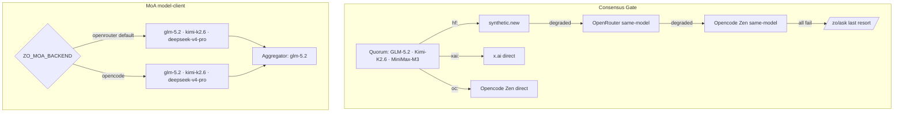

# LLM Configuration — Consensus Gate & MoA

Snapshot of every model, provider, and failover rung wired into the two consumers.
Source of truth: `scripts/consensus-gate.ts`, `scripts/catalog*.ts`, and
`../zo-memory-system/scripts/model-client.ts`. Account state: Opencode Zen **funded**, all
failover rungs **on by default**.

---

## 1. Providers & keys

| Provider | Secret | Endpoint | Role |
|---|---|---|---|
| synthetic.new | `SYNTHETIC_NEW_API_KEY` | `api.synthetic.new/openai/v1` | **Primary** for `hf:` models |
| OpenRouter | `OPENROUTER_API_KEY` | `openrouter.ai/api/v1` | Same-model failover #1 / MoA default backend |
| Opencode Zen | `OPENCODE_API_KEY` | `opencode.ai/zen/v1` | Same-model failover #2 / `oc:` direct / MoA alt backend |
| xAI | `XAI_API_KEY` | `api.x.ai/v1` | Direct route for `xai:` ids |
| Zo | `ZO_TOKEN` | `api.zo.computer/zo/ask` | Last-resort fallback |

---

## 2. Consensus Gate — quorum & routing

**Default quorum** (3f+1, family-diverse):

| Model | Label | Native provider |
|---|---|---|
| `hf:zai-org/GLM-5.2` | GLM | synthetic.new |
| `hf:moonshotai/Kimi-K2.6` | Kimi | synthetic.new |
| `hf:MiniMaxAI/MiniMax-M3` | MiniMax | synthetic.new |
| `xai:grok-3-mini` | Grok-3-Mini | xAI (used in quarantine default trio) |

**Per-call provider routing** (by id prefix):

```
xai:*  ───────────────► x.ai (direct)
oc:*   ───────────────► Opencode Zen (direct)
hf:*   ──► synthetic.new (primary)
            │  degraded? (empty / API error / unparseable)
            ├─► OpenRouter  same model   [CG_OPENROUTER_FAILOVER, default ON]
            └─► Opencode Zen same model  [CG_OPENCODE_FAILOVER,   default ON]
       sole-provider mode (no synthetic key): OpenRouter-only ► Opencode-only
       no keys at all: /zo/ask  ►  mock verdicts
```

**Same-model id mapping across providers:**

| Canonical (`hf:`) | OpenRouter | Opencode Zen |
|---|---|---|
| `hf:zai-org/GLM-5.2` | `z-ai/glm-5.2` | `oc:glm-5.2` |
| `hf:moonshotai/Kimi-K2.6` | `moonshotai/kimi-k2.6` | `oc:kimi-k2.6` |
| `hf:MiniMaxAI/MiniMax-M3` | `minimax/minimax-m3` | `oc:minimax-m3` |

*Rule:* `zai-org→z-ai`, `MiniMaxAI→minimax` for OpenRouter; Opencode drops the org segment entirely and lowercases.

---

## 3. Consensus Gate — substitution chains (quarantine / quorum repair)

When a primary is quarantined, `getChain()` resolves a same-tier, family-diverse replacement.
Chains are seeded by `DEFAULT_CHAINS` and refreshed live from three catalogs
(synthetic 14 · openrouter 339 · opencode 49 models, daily via `catalog-refresh-all.ts`).

| Primary | Substitution chain (in order) |
|---|---|
| GLM-5.2 | DeepSeek-R1-0528 → Kimi-K2.6 → Qwen3.5-397B → Qwen3-235B-Thinking → MiniMax-M3 |
| Kimi-K2.6 | DeepSeek-R1-0528 → Qwen3.5-397B → Qwen3-235B-Thinking → GLM-5.2 → MiniMax-M3 |
| MiniMax-M3 | DeepSeek-R1-0528 → Kimi-K2.6 → Qwen3.5-397B → GLM-5.2 → DeepSeek-V3.2 |

---

## 4. MoA (`model-client.ts`) — proposers + aggregator

Selectable backend via `ZO_MOA_BACKEND` (default `openrouter`). Override proposers/aggregator
with `ZO_MOA_PROPOSERS` / `ZO_MOA_AGGREGATOR`.

| Backend | Proposers | Aggregator |
|---|---|---|
| **openrouter** (default) | `z-ai/glm-5.2`, `moonshotai/kimi-k2.6`, `deepseek/deepseek-v4-pro` | `z-ai/glm-5.2` |
| **opencode** (funded, paid) | `glm-5.2`, `kimi-k2.6`, `deepseek-v4-pro` | `glm-5.2` |
| opencode — free fallback | `deepseek-v4-flash-free`, `mimo-v2.5-free`, `nemotron-3-ultra-free` | (set via env) |

Flow: N proposers answer in parallel → responses concatenated → aggregator synthesizes one
answer. `max_tokens` floored at 4096; content→`reasoning_content` fallback.

`model-client` providers: `openai` · `anthropic` · `openrouter` · `opencode` · `moa`.

---

## 5. Failover overview (mermaid)


