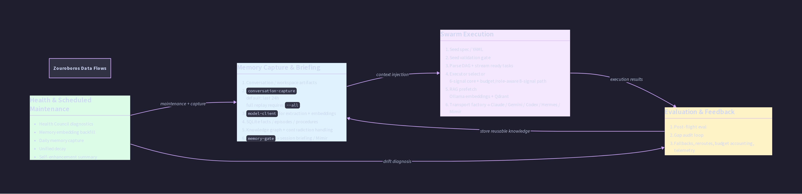

# Architecture Overview

Zouroboros is designed as a modular, self-enhancing AI infrastructure platform.

## Design Principles

1. **Modularity** - Use only what you need
2. **Extensibility** - Plugin architecture for custom components
3. **Self-Healing** - Built-in diagnostics and improvement
4. **Developer Experience** - Simple CLI, clear docs, fast feedback

## System Architecture

<p align="center">
  
</p>

The command layer consists of the CLI, TUI dashboard, Hono API + SSE surface, and scheduled agents. Below, three core pillars — **Memory System**, **Swarm Orchestration**, and **Workflow Tools** — connect to the **Personas Framework**, **Health Council**, and **Self-Heal Engine**. Swarm orchestration dispatches through a transport factory to five executors: Claude Code, Codex CLI, Gemini CLI, Hermes Agent, and Mimir Memory Sage.

## Package Structure

### Core (`zouroboros-core`)
- Shared types and interfaces
- Configuration management
- Constants and utilities

### Memory (`zouroboros-memory`)
- **Episodic Memory**: Conversation history, events
- **Procedural Memory**: Learned procedures, workflows
- **Cognitive Profiles**: Per-entity preferences and facts
- **Graph-boosted Search**: Semantic + relational queries
- **HyDE Expansion**: Hypothetical document embeddings

### Swarm (`zouroboros-swarm`)
- **Adaptive Routing**: 6-signal core with budget/role-aware 8-signal path
- **DAG Streaming**: Dependency-aware parallel execution
- **Transport Abstraction**: ACP, bridge, and Mimir transports
### Personas (`zouroboros-personas`)
- **8-Phase Creation**: Planning → Deployment
- **Template System**: Reusable persona patterns
- **SkillsMP Integration**: Community skill discovery
- **MCP Wrappers**: AI tool integration

### Self-Heal (`zouroboros-selfheal`)
- **Introspect**: Health scorecard across all subsystems
- **Prescribe**: Generate improvement plans
- **Evolve**: Execute autonomous improvements

### Health Council
Four autonomous watchers monitor distinct layers — see [Health Council](./health-council.md) for full details.

| Seat | Layer | Cadence |
|------|-------|---------|
| Healer | Runtime (model availability) | Every 2 hours |
| Doctor | Orchestration (agent fleet) | Weekly |
| Introspector | Capability (skills, identity) | Weekly |
| Steward (Mimir) | Knowledge (memory graph) | Daily |

## Data Flow

<p align="center">
  
</p>

Four core pipelines drive the system:

- **Memory Capture & Briefing** — Conversation artifacts → `conversation-capture` → provider-routed extraction/embeddings → SQLite facts + graph → memory gate → session briefing / Mimir synthesis
- **Swarm Execution** — Seed spec → seed validation → Parse DAG → adaptive routing → RAG enrichment → transport factory → executor pool → streaming results
- **Evaluation & Feedback** — Post-flight eval → gap audit loop → reroute / recovery / telemetry → reusable episodes and facts
- **Health & Scheduled Maintenance** — Health Council + embedding backfill + daily memory capture + unified decay + self-enhancement + vault indexing

## Configuration

All packages share a unified configuration system:

```typescript
// ~/.zouroboros/config.json
{
  "version": "2.0.0",
  "memory": { /* memory-specific settings */ },
  "swarm": { /* swarm-specific settings */ },
  "personas": { /* persona-specific settings */ },
  "selfheal": { /* self-healing settings */ }
}
```

## Extension Points

### Plugins
Add new capabilities without modifying core:

```bash
zouroboros plugin install n8n
zouroboros plugin install code-server
```

### Custom Executors
Implement the bridge protocol to add new agents:

```bash
# bridges/my-custom-agent.sh
#!/bin/bash
# Your agent integration here
```

### MCP Servers
Integrate external AI tools:

```typescript
// ~/.zouroboros/mcp/my-mcp.json
{
  "name": "my-mcp",
  "url": "http://localhost:3001/sse"
}
```
